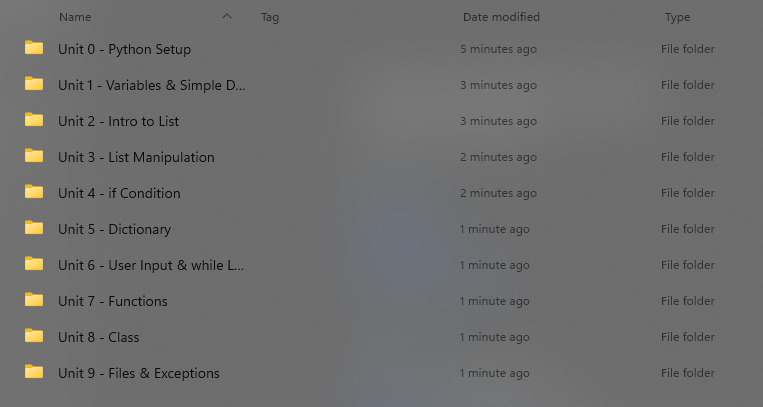

# Unit 0 - Starting Python
## 0.0 - Table of Contents

[TOC]
## 0.1 - Finish Python Setup

- Take a break if you are done
- If not, please do it now and feel free to ask any questions


## 0.2 - A Note On Organization

- A method of organizing your code is very important

- Recommend organizing by units. (This is how the course itself is structured)

  

## 0.3 - Hello, world!

- The first line of code in a new language: `Hello, world!`

  
  

### 0.3.1 - Code

#### `hello_world.py`

```python
print(“Hello, world!”)
```
## 0.4 - Ways to Run Code

- There are two options to run a python code

  - Preferred Way in Sublime Text: `Ctrl/Cmd + B`, or `Tools > Build`
  - Alternative Way: `python hello_world.py`

## 0.5 - Homework

None

